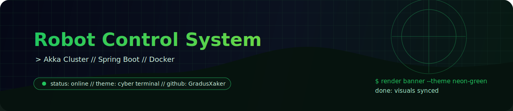

<div align="center">
  

  <h1>Robot Control System</h1>
  <p><strong>Демо распределенной робототехники.</strong> `Akka Cluster`, `Java`, `Spring Boot` и `Docker` в одном учебном примере.</p>

  <p>
    
    
    
    
  </p>
</div>

```text
> stack: akka cluster + spring boot + docker
> scenario: actor-based concurrency demo
> target: study distributed enterprise patterns
```

## обзор

Репозиторий показывает, как собрать демонстрационную систему управления роботами на акторной модели и контейнерной инфраструктуре, не распыляя проект по нескольким сервисам и конфигурациям.

## Что показывает проект

- кластерное взаимодействие сервисов;
- акторную модель и обмен сообщениями;
- использование `Spring Boot` для инфраструктурной части;
- контейнеризацию и запуск через `Docker`.

## Для чего репозиторий полезен

- как учебный пример распределенной системы;
- как отправная точка для экспериментов с `Akka Cluster`;
- как демонстрация интеграции Java-стека с контейнерным окружением.


